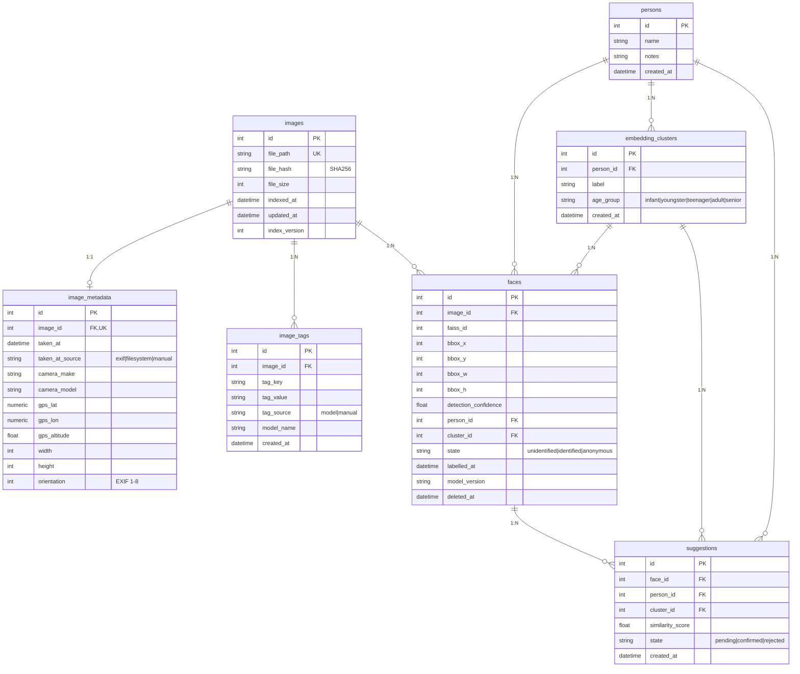

# CLAUDE.md — PhotoAIdent

## Project Overview

PhotoAIdent is a local, privacy-first desktop application for AI-powered face
recognition and photo search. It scans a local photo library, detects and embeds
faces using InsightFace/ArcFace, and provides a PySide6 desktop UI where the user
progressively labels faces — assigning them to known persons or marking them as
anonymous. Over time the app learns who is in the collection and surfaces match
suggestions automatically.

No cloud, no external API calls, no data leaves the machine.

---

## ⚠️ CRITICAL: Image Collection Is Read-Only

**The app must NEVER write to, modify, move, rename, or delete any file in the
user's image collection.**

This is an absolute, non-negotiable constraint. The original photos are the user's
irreplaceable personal archive spanning decades.

- All output (databases, thumbnails, caches) goes to XDG directories (see below)
- The indexer opens image files in read-only mode only
- No file watcher, sync tool, or any subsystem touches image files
- Any coding agent working on this project must never write code that performs
  write operations on paths outside of `~/.local/share/photoaident/` and
  `~/.cache/photoaident/`
- If in doubt: **do not touch the image collection**

---

## Agent Instructions

Before marking any task or phase as complete:

1. Lint the code using `uv run ruff check --fix` and fix any reported issues
2. Format the code consistently using `uv run black`
3. Ensure proper type checking using `uv run ty check` and fix any reported issues
4. Run `uv run scripts/verify.py` and ensure it exits with code 0
5. Fix any issues reported before declaring the work done
6. Never skip verification even if the changes appear trivial

## ⚠️ Internationalization (i18n)

**The UI must be fully internationalized. All user-facing strings must be
translatable.**

- Wrap all user-facing strings in `self.tr()` (Qt's translation system)
- Keep translation source files (`assets/translations/*.ts`) up to date
- If you add or modify UI strings, run `pyside6-lupdate` to update `.ts` files
- Verification scripts (`verify.py`, pre-commit hook) will fail if translations
  are out of date
- See README.md for specific commands to update and compile translations
- Always translate all UI strings to English and German

---

## Scale Characteristics

The target collection is ~80,000 JPEG images spanning ~30 years. Key implications:

- **Estimated face vectors:** ~240,000 (assuming ~3 faces/image average)
- **FAISS index RAM usage:** ~500 MB (240k × 512 dims × 4 bytes)
- **Face crop cache:** ~2.4 GB (240k crops × ~10 KB average)
- **SQLite database:** comfortably small at this row count — no performance concern

`IndexFlatIP` (exact search) is appropriate at this scale. Search over 240k vectors
takes single-digit milliseconds on CPU. An approximate index (IVF/HNSW) is not
needed and would only add complexity. Reassess if the collection grows beyond ~5M
vectors.

The 30-year span means a person's appearance changes dramatically. A single mean
embedding per person will not work — see the **Embedding Clusters** section.

---

## XDG-Compliant File Locations

PhotoAIdent follows the XDG Base Directory Specification for all runtime data.
Nothing is written next to the binary or in the image collection.

| Content                             | Path                                           |
|-------------------------------------|------------------------------------------------|
| User config (settings, preferences) | `~/.config/photoaident/config.toml`            |
| SQLite database                     | `~/.local/share/photoaident/db/photoaident.db` |
| FAISS index                         | `~/.local/share/photoaident/db/faiss.index`    |
| Face crop thumbnails                | `~/.cache/photoaident/faces/<face_id>.jpg`     |
| Photo thumbnails                    | `~/.cache/photoaident/thumbs/<image_hash>.jpg` |

`~/.local/share/` is for data that should persist across reboots and is worth
backing up. `~/.cache/` is for data that can be regenerated — thumbnails and face
crops can be deleted and rebuilt by re-indexing.

In code, always resolve these paths via a central `AppPaths` helper class rather
than constructing them inline, so they can be overridden cleanly in tests.

---

## Core User Workflow

1. **Index** — user points the app at a folder. The app scans all images
   read-only, detects faces, computes embeddings, and stores everything in the
   local database. All faces start as unidentified.

2. **Label** — the app presents unidentified face crops to the user. The user
   assigns each face to a known person, creates a new person, or marks it as
   "anonymous" (a stranger the user doesn't want to track).

3. **Propagate** — after a face is labelled, the suggestion engine finds similar
   unidentified faces and queues them for fast confirm/reject review. Confirmed
   suggestions grow the person's embedding cluster.

4. **Search** — filter the photo library by person, date range, GPS area, and
   eventually scene tags.

---

## Embedding Clusters (Multi-Era Persons)

The 30-year span means a single mean embedding per person fails at the appearance
extremes (baby → adult). Each person therefore has exactly **5 fixed age-group
clusters**, created automatically when the person record is first inserted:

| Key          | Display label    | Age range |
|--------------|-----------------|-----------|
| `infant`     | Infant (0–3)    | 0–3       |
| `youngster`  | Youngster (4–12)| 4–12      |
| `teenager`   | Teenager (13–19)| 13–19     |
| `adult`      | Adult (20–75)   | 20–75     |
| `senior`     | Senior (75+)    | 75+       |

The canonical key list is `AGE_CLUSTERS` in `db/database.py`. The
`EmbeddingCluster.age_group` column stores the key; `label` is set to the same
value at creation time. Free-form cluster creation is not supported.

A face matches a person if it is within the similarity threshold of **any** of
their clusters. When labelling a face the UI computes cosine similarity between
the query embedding and each cluster's mean embedding, and pre-selects the
best-matching slot.

---

## Face States

- `unidentified` — no person assigned, appears in the labelling queue
- `identified` — assigned to a person and cluster
- `anonymous` — permanently dismissed, never shown in the queue again

---

## Tech Stack

| Layer                      | Technology                        | Notes                      |
|----------------------------|-----------------------------------|----------------------------|
| Language                   | Python 3.12                       |                            |
| UI                         | PySide6 6.10+                     |                            |
| Face detection & embedding | InsightFace (ArcFace)             | GPU-accelerated            |
| ML runtime                 | ONNX Runtime GPU                  | CUDA via NVIDIA driver     |
| Vector search              | FAISS `IndexFlatIP`               | CPU, exact search          |
| Relational metadata        | SQLAlchemy 2.0 + SQLite           |                            |
| Schema migrations          | Alembic                           | Auto-applied at startup    |
| Package manager            | uv                                |                            |
| Linter/formatter           | ruff, black                       |                            |
| Type checker               | ty                                |                            |
| Testing                    | pytest, pytest-qt, pytest-alembic | In-memory SQLite for tests |
| Distribution               | PyInstaller + appimagetool        | AppImage                   |

---

## Project Structure

Files marked `[TODO]` are planned but not yet implemented.

```
photo-aident/
├── src/photoaident/
│   ├── __init__.py
│   ├── __main__.py              # Entry point, instance lock, migration boot
│   ├── app.py                   # QApplication bootstrap + MainWindow
│   ├── paths.py                 # AppPaths: XDG path resolution, test override
│   ├── settings.py              # Settings (TOML, currently: collection_path)
│   ├── core/
│   │   ├── indexer.py           # InventoryTask + IndexingTask (Qt threads)
│   │   ├── embeddings.py        # InsightFace/ArcFace wrapper
│   │   ├── search.py            # [TODO] Similarity search + metadata filters
│   │   └── labeller.py          # [TODO] Suggestion engine
│   ├── db/
│   │   ├── database.py          # SQLAlchemy models + session factory
│   │   ├── migrate.py           # Alembic runner (auto-applied at startup)
│   │   ├── migrations/          # Alembic migration scripts
│   │   │   ├── env.py
│   │   │   ├── script.py.mako
│   │   │   └── versions/
│   │   └── vector_store.py      # FAISS index wrapper
│   ├── ui/
│   │   ├── preferences_dialog.py
│   │   ├── pages/
│   │   │   ├── library.py       # LibraryPage: thumbnail grid + filter
│   │   │   ├── labelling.py     # LabellingPage: face-by-face labelling queue
│   │   │   └── persons.py       # PersonsPage: reference face management
│   │   └── widgets/
│   │       ├── thumbnail_grid.py
│   │       ├── image_detail_dialog.py
│   │       ├── progress_dialog.py
│   │       ├── face_crop.py     # FaceCropWidget: crop + thumbnail display
│   │       └── person_card.py   # [TODO] PersonCard for persons page
│   └── utils/
│       ├── image_utils.py       # generate_thumbnail() (read-only)
│       └── instance_lock.py     # fcntl-based single-instance lock
├── tests/
│   ├── conftest.py              # Shared fixtures: temp AppPaths, in-memory DB
│   ├── test_app.py
│   ├── test_database.py
│   ├── test_embeddings.py
│   ├── test_image_detail_dialog.py
│   ├── test_indexer.py
│   ├── test_instance_lock.py
│   ├── test_paths.py
│   ├── test_preferences_dialog.py
│   ├── test_progress_dialog.py
│   ├── test_settings.py
│   ├── test_thumbnail_grid.py
│   ├── test_vector_store.py
│   ├── test_persons_page.py
│   ├── test_search.py           # [TODO] once search.py exists
│   ├── test_labeller.py         # [TODO] once labeller.py exists
│   └── fixtures/
│       └── images/              # Small real JPEGs for integration tests
├── alembic.ini
├── photoaident.spec
├── pyproject.toml
└── uv.lock
```

### Implementation Status

| Component                  | Status     | Notes                                        |
|----------------------------|------------|----------------------------------------------|
| DB schema + migrations     | ✓ Complete | 5 migrations applied                         |
| FAISS vector store         | ✓ Complete | IndexFlatIP, save/load                       |
| Face embedding (ArcFace)   | ✓ Complete | GPU with CPU fallback                        |
| Indexer (inventory + embed)| ✓ Complete | Qt-threaded, auto-runs at startup            |
| AppPaths / XDG             | ✓ Complete |                                              |
| Settings                   | ✓ Minimal  | Only `collection_path` so far               |
| MainWindow (app.py)        | ✓ Functional| Sidebar navigation, 3 pages                 |
| LibraryPage                | ✓ Functional| Thumbnail grid + 3-way filter + detail view |
| LabellingPage              | ✓ Functional| Face-by-face queue + assign/skip/anonymous  |
| FaceCropWidget             | ✓ Complete | Crop + thumbnail + date/confidence display  |
| AssignPersonDialog         | ✓ Complete | Age-group cluster table + similarity scoring|
| PreferencesDialog          | ✓ Complete |                                              |
| PersonsPage                | ✓ Complete | Reference face review + staged remove/move  |
| core/search.py             | ✗ TODO     | Phase 8                                      |
| core/labeller.py           | ✗ TODO     | Phase 6                                      |

---

## Database Schema

The schema is designed so that new analysis passes (metadata, scenery
classification, GPS search) can be added later without touching existing tables.
Each concern lives in its own table. Alembic manages all schema evolution.



---

## Schema Migrations (Alembic)

Migrations run automatically at app startup — the user never runs CLI commands.

To generate a new migration after changing models:

```bash
uv run alembic revision --autogenerate -m "describe the change"
```

Always review autogenerated migrations before committing — Alembic's SQLite
support requires `render_as_batch=True` in `env.py` for column alterations.

---

## Reindexing Strategy

Reindexing re-runs face detection and embedding on already-indexed images without
losing any labelling work.

**Triggers:**

- User explicitly requests full reindex
- A new embedding model version is deployed (`model_version` mismatch)
- File hash changes (file was modified externally — though the collection should
  never be touched, external tools might update EXIF)

**What is always preserved:**

- All `Person` and `EmbeddingCluster` records
- All face assignments (`state = identified`) and dismissals (`state = anonymous`)
- All `image_metadata` and `image_tags` records
- All `Suggestion` records

**Reindex algorithm per image:**

1. Run detection + embedding on the image (read-only file access)
2. Match new detections to existing face records by bounding box IoU ≥ 0.5
3. For matched faces: update `faiss_id` and `model_version`, preserve state and
   person assignment
4. For new detections (no match): insert as `unidentified`
5. For old faces with no detection match: soft-delete (`deleted_at` timestamp),
   preserving history
6. Update `images.index_version` and `images.updated_at`

---

## Search Strategy

Search always combines FAISS (face similarity) with SQLite (metadata filters):

1. FAISS query returns candidate `faiss_id` list for the selected person/cluster
2. SQLite JOIN resolves face → image → image_metadata → image_tags
3. Metadata predicates applied in SQL (date range, GPS bbox, tag confidence)
4. Results deduplicated by image, returned to UI

For pure metadata queries with no person filter (future feature): skip FAISS,
query SQLite directly using the metadata indexes.

---

## Zero-Install Development & Testing

No external database server is required at any point. SQLite is embedded.

* `paths.py` — central path resolver
* `tests/conftest.py` — shared fixtures

Tests use `db_session` for full isolation — each test gets a clean transaction
that is rolled back afterwards. Migrations run once per session. No server, no
docker, no setup steps beyond `uv sync`.

---

## Test Coverage Targets

| Module               | Coverage target | Notes                                                 |
|----------------------|-----------------|-------------------------------------------------------|
| `db/database.py`     | 95%+            | Models, relations, state transitions                  |
| `db/vector_store.py` | 95%+            | Add, search, persist, reload                          |
| `core/indexer.py`    | 80%+            | Use fixture images; mock GPU calls                    |
| `core/search.py`     | 90%+            | End-to-end with fixture data                          |
| `core/labeller.py`   | 85%+            | Suggestion generation logic                           |
| `paths.py`           | 100%            | Trivial but critical                                  |
| `ui/`                | Best-effort     | pytest-qt for smoke tests; avoid testing Qt internals |

GPU-dependent code (`embeddings.py`) should be covered by integration tests that
are skipped when `CUDAExecutionProvider` is unavailable (`pytest.mark.gpu`).
All other tests must run without a GPU.

---

## Development Commands

```bash
uv sync                              # Install all dependencies
uv run photoaident                   # Run the app
uv run pytest                        # All tests (no GPU required)
uv run pytest -m gpu                 # GPU integration tests only
uv run pytest --cov=photoaident      # With coverage report
uv run ruff check                    # Lint
uv run ruff format                   # Format
uv run ty check                      # Type check
uv run alembic revision --autogenerate -m "description"  # New migration
uv run alembic upgrade head          # Apply migrations manually (dev use)
./scripts/build_pyinstaller.sh       # PyInstaller bundle
./scripts/build_appimage.sh          # AppImage
```

---

## GPU / CUDA Notes

- Target: NVIDIA RTX 4070, driver 580, CUDA 13
- ONNX Runtime GPU handles CUDA internally — no system `nvcc` needed
- InsightFace selects `CUDAExecutionProvider` automatically when available
- App works on CPU-only machines — indexing is slower but functional
- GPU availability shown in the status bar at startup
- All tests except `@pytest.mark.gpu` must pass on CPU-only CI

---

## Distribution

- PyInstaller bundles Python 3.12, PySide6, InsightFace, FAISS, and all deps
- Wrapped into `.AppImage` via `appimagetool` (not `appimage-builder`)
- Host provides: glibc, libGL/CUDA drivers, libxcb
- CUDA on target machine: optional — app falls back to CPU gracefully
