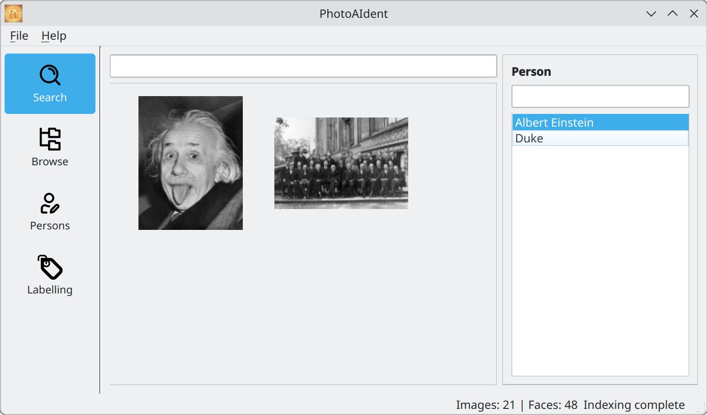
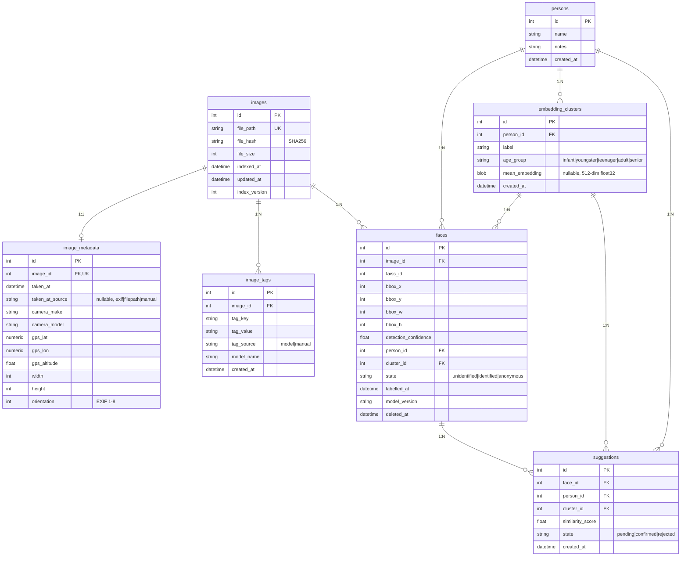

[](https://sonarcloud.io/summary/new_code?id=steinsag_photoaident)


# PhotoAIdent

PhotoAIdent is a local, privacy-first desktop application for AI-powered face
recognition and photo search. It scans a local photo library, detects and embeds
faces using InsightFace/ArcFace, and provides a PySide6 desktop UI where the user
progressively labels faces — assigning them to known persons or marking them as
anonymous. Over time the app learns who is in the collection and surfaces match
suggestions automatically.

No cloud, no external API calls, no data leaves the machine.



## Initial setup

This project uses package manager [uv](https://github.com/astral-sh/uv) to manage
dependencies. Because the ONNX Runtime packages conflict with each other, you must
choose exactly **one** of the three runtime groups below. No group is installed by
default — the app will not start until one is selected.

The Python version (3.12) is pinned in `.python-version` and picked up automatically
by uv — no `--python` flag needed.

### NVIDIA GPU (CUDA)

```bash
uv sync --group cuda
```

### CPU / Apple Silicon (CoreML)

```bash
uv sync --group cpu_coreml
```

### Intel CPU / iGPU / NPU (OpenVINO)

For Intel hardware including the N100 and other Alder/Raptor Lake processors:

```bash
uv sync --group openvino
```

> **Note:** only install one runtime group. The packages conflict — installing more
> than one at the same time will cause import errors.

## Hardware acceleration

PhotoAIdent automatically uses the best available execution provider in this priority order:

1. **CUDA** (`onnxruntime-gpu`) — NVIDIA GPU
2. **CoreML** (`onnxruntime`) — Apple Silicon / macOS
3. **OpenVINO** (`onnxruntime-openvino`) — Intel CPU / iGPU / NPU (x86_64 only)
4. **CPU** — always available as fallback within any of the above packages

The status bar at the bottom of the window confirms which provider is active.

## Running the app

    uv run photoaident

## Verify (format, lint, type-check, tests)

One command to auto-fix formatting/lints, run type checks, and tests:

      uv run scripts/verify.py

This runs, in order: `black --target-version py312 .`, `ruff check --fix .`, `pyright src/ tests/`, `ty check`, `pytest`.

## Translations (i18n)

To update translation source files (`.ts`) after adding or removing strings:

    uv run pyside6-lupdate -locations none -extensions py src/ -ts assets/translations/photoaident_de.ts assets/translations/photoaident_en.ts

Flags explained:

- `-locations none` — omits `<location>` line-number tags so `.ts` files only
  change when strings actually change, not on every code reformat. This makes
  `git diff` reliable as a staleness check.
- `-extensions py` — required when passing a directory; lupdate's default
  extension list does not include Python files.

To compile them to binary format (`.qm`) for the app to load them:

    for ts in assets/translations/*.ts; do uv run pyside6-lrelease "$ts" -qm "${ts%.ts}.qm"; done

Note: The build scripts automatically generate `.qm` files. You only need to run this manually if you want to see the
translations when running the app via `uv run photoaident`.

## Code formatting (Black)

[Black](https://black.readthedocs.io/) is used for code formatting.

Check formatting:

      uv run black --check --target-version py312 .

Auto-format the code locally:

      uv run black --target-version py312 .

## Linting (Ruff)

[Ruff](https://docs.astral.sh/ruff/) enforces common Python lint rules and import sorting.

Run Ruff for the whole project:

    uv run ruff check .

Optionally, to auto-fix what Ruff can fix:

    uv run ruff check . --fix

## Static type checking (pyright)

[Pyright](https://github.com/microsoft/pyright) is used for static type checking.

Run pyright for the whole project:

    uv run pyright --pythonversion 3.12 src/ tests/

## Static type checking (ty)

[ty](https://docs.astral.sh/ty/) is used for static type checking.

Run ty for the whole project:

    uv run ty check

## Running tests (with coverage)

Pytest is configured to generate coverage reports automatically via pytest-cov.

Run tests:

    uv run pytest

After the run you'll get:

- Terminal coverage summary (missing lines shown, skip-covered enabled)
- HTML report in htmlcov/index.html
- XML report in coverage.xml

## Git pre-commit hooks

Enable the repository-managed pre-commit hook so that linters and formatters run before each commit:

    git config core.hooksPath .githooks

What it does:

- Runs pyright: `uv run pyright src/ tests/`
- Runs ty: `uv run ty check`
- Runs Ruff lint: `uv run ruff check .`
- Runs Black in check mode: `uv run black --check --target-version py312 .`
- Blocks the commit if linting, formatting, or typing issues are found

To bypass the hook: `git commit --no-verify`

## Standing on shoulders

### Open Source Libraries

- [InsightFace](https://www.insightface.ai/)
- [FAISS](https://faiss.ai/)
- [PySide6](https://doc.qt.io/qtforpython-6/)
- [ONNX Runtime](https://onnxruntime.ai/)
- [SQLAlchemy](https://www.sqlalchemy.org/)
- [Alembic](https://alembic.sqlalchemy.org/)
- [ExifRead](https://github.com/ianare/exif-py)
- [Pillow](https://python-pillow.github.io/)
- [OpenCV](https://opencv.org/)
- [NumPy](https://numpy.org/)

### Icon Sources

- [Wikimedia](https://commons.wikimedia.org/)
- [SVG Repo](https://www.svgrepo.com/)

## Database Schema


